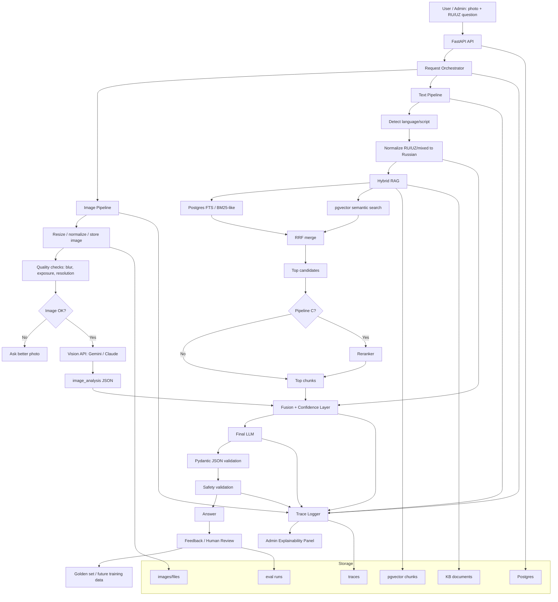

# AI Agronomy Assistant Architecture Plan

Date: 2026-05-23

This document captures the current architecture plan for a FastAPI prototype of an AI agronomy / plant disease assistant. The goal is to compare architecture options and present measurable results to the Growz team before committing to a production implementation.

## Goal

Farmers upload a crop or plant photo and ask a question in Russian, Uzbek, or mixed language, for example:

> Пшеница желтеет, нижние листья сохнут, что делать?

The system should suggest possible disease, nutrient deficiency, pest damage, or environmental stress, then provide safe practical advice with citations and visible uncertainty.

This is a prototype, not a production diagnosis engine. The priority is to compare architecture variants, expose how each subsystem behaved, and create a repeatable evaluation loop.

## Constraints

- Stack: Python + FastAPI.
- Run locally with Docker Compose.
- Use PostgreSQL + pgvector.
- Do not use PHP / Laravel.
- Do not use LangChain first; keep retrieval and orchestration explicit.
- RAG is text-only.
- Photo handling is a separate vision pipeline.
- Prototype may use Gemini Vision or Claude Vision API.
- Later, Vision API can be replaced by EfficientNet, ConvNeXt, YOLO, or CLIP/SigLIP retrieval.
- Knowledge base is Russian-first.
- Sources can be English and Russian, but canonical indexed chunks should be Russian.
- User input can be Russian, Uzbek Latin, Uzbek Cyrillic, or mixed.
- Output should be in the user's language.
- Admin UI must include trace and explainability panels.

## High-Level Architecture



## Core Data Flow

```text
Photo
  -> resize/compress
  -> quality check
  -> Vision API or future local vision model
  -> image_analysis JSON

Text
  -> detect language/script
  -> normalize Russian/Uzbek/mixed input to Russian
  -> hybrid retrieval
  -> retrieved chunks with citations

Fusion
  -> image_analysis + retrieved chunks + original question
  -> confidence decision
  -> final LLM
  -> validated JSON
  -> farmer/admin answer
```

Important rule: in the long-term architecture the final LLM should not receive the raw photo. It receives structured text output from the image pipeline plus retrieved RAG context. For the prototype, Vision API may inspect the photo behind a replaceable provider interface.

## Architecture Variants To Compare

| Pipeline | Purpose | Retrieval | Generation | Expected Role |
|---|---|---|---|---|
| A. Pure LLM / Vision LLM | Baseline | None | Prompt-only answer | Shows what simple ChatGPT/Gemini-style flow does |
| B. Hybrid RAG | Main MVP candidate | Postgres FTS + pgvector + RRF | Grounded answer with citations | Default candidate |
| C. Hybrid RAG + Reranker | Quality candidate | Same as B, then rerank top candidates | Answer from reranked context | Higher quality, more latency/cost |

### Pipeline A: Pure LLM / Vision LLM

Input:

- Farmer question.
- Optional photo.
- Optional crop, region, growth stage.

Steps:

1. Detect language.
2. Send question and optionally photo to the LLM/Vision LLM.
3. Ask for cautious structured output.
4. Validate with Pydantic.
5. Store trace.

Pros:

- Fastest to implement.
- Useful baseline.
- Good for demonstrating hallucination risk.

Cons:

- No citations.
- High hallucination risk.
- Weak safety for treatments and pesticide advice.

### Pipeline B: Hybrid RAG

Input:

- Farmer question.
- Optional structured image analysis.
- Optional crop, region, growth stage.

Steps:

1. Detect language and script.
2. Normalize query to Russian.
3. Extract crop, symptom, region, disease/pest/nutrient entities.
4. Run Postgres full-text search.
5. Run pgvector semantic search.
6. Merge results with Reciprocal Rank Fusion.
7. Select top chunks.
8. Generate grounded answer with citations.
9. Validate JSON and safety rules.
10. Store trace and retrieval hits.

Pros:

- Grounded.
- Inspectable.
- Good MVP default.
- Works well with Russian-first curated knowledge.

Cons:

- Quality depends on KB quality.
- Retrieval can miss Uzbek aliases if normalization is weak.

### Pipeline C: Hybrid RAG + Reranker

Steps:

1. Same as Pipeline B through hybrid candidate generation.
2. Take top 30-50 candidates.
3. Rerank with multilingual reranker.
4. Send top 6-10 chunks to final LLM.
5. Store pre-rerank and post-rerank ranks.

Pros:

- Better context precision.
- Useful for ambiguous or safety-critical cases.

Cons:

- Adds latency and cost.
- Needs careful tracing to prove benefit.

## RAG Design

RAG type:

```text
Hybrid RAG = Postgres full-text search + pgvector semantic search + RRF merge + optional reranker
```

Why not vector-only:

- Agronomy contains exact terms, chemical names, disease names, and crop names.
- Exact keywords like "септориоз", "карбамид", "тля", "ржавчина" matter.

Why not BM25-only:

- Farmers describe symptoms informally.
- Uzbek/Russian mixed wording requires semantic matching.

Why hybrid:

- Full-text search catches exact agronomy terms.
- Vector search catches symptom meaning and paraphrases.
- RRF combines both without over-trusting one method.

Default settings:

```text
chunk_size: 400-700 tokens
chunk_overlap: 80-120 tokens
vector_candidates: 60
lexical_candidates: 60
rrf_k: 60
rerank_candidates: 30-50
final_context_chunks: 6-10
temperature: 0.2
```

Canonical KB language:

- Russian.

Sources:

- Russian agronomy materials.
- English sources such as FAO, CABI, EPPO, Plantwise, translated/normalized into Russian chunks.

User input:

- Russian.
- Uzbek Latin.
- Uzbek Cyrillic.
- Mixed RU/UZ.

Retrieval normalization:

1. Detect language and script.
2. Normalize Uzbek/Russian aliases.
3. Translate or rewrite to Russian.
4. Extract crop/symptoms/problem entities.
5. Retrieve against Russian KB.

## Chunk Metadata

Each chunk should carry enough metadata for filtering, tracing, and citations:

```text
source_id
document_id
chunk_index
title
section_title
heading_path
text_ru
text_original
language_original
crop
region
country
topic
problem_type
phenological_stage
disease_names
pest_names
nutrient_names
chemical_names
safety_flags
trust_level
source_url
published_at
metadata
```

Embedding text should include compact metadata:

```text
Культура: хлопок
Регион: Узбекистан
Тема: вредители
Раздел: Борьба с тлей
Текст: ...
```

## Image Pipeline

Prototype:

```text
photo -> resize/compress -> quality check -> Gemini/Claude Vision -> image_analysis JSON
```

Future:

```text
photo -> resize/compress -> quality check -> EfficientNet/ConvNeXt classifier -> top diagnoses
```

Optional future detection:

```text
YOLO -> detect lesion/leaf/pest regions -> crop regions -> classifier
```

Optional future retrieval:

```text
CLIP/SigLIP -> retrieve visually similar reference cases
```

YOLO is not first because:

- Most open datasets are classification datasets, not bounding-box datasets.
- YOLO requires bbox labels.
- For close-up leaf photos, classifier/Vision API is enough for a prototype.
- YOLO becomes useful when many photos are whole-canopy shots or when severity/localization is needed.

## Image Quality Checks

Before expensive vision calls:

- Validate MIME: JPEG, PNG, WebP.
- Max size: 10 MB.
- Convert to RGB.
- Auto-orient.
- Resize long edge to 1024-1600 px.
- Compute blur score.
- Compute exposure score.
- Check resolution.
- Store original and normalized image hashes.
- Generate thumbnail for admin UI.

Quality decision:

```json
{
  "quality_status": "pass | warn | fail",
  "quality_score": 0.82,
  "issues": ["blurry", "too_dark"],
  "recommended_user_action": "Retake photo in daylight, closer to affected leaves."
}
```

If quality fails, do not produce a diagnosis. Ask for a better image and provide only general safe guidance.

## image_analysis Schema

```json
{
  "schema_version": "image_analysis.v1",
  "provider": "gemini | claude | future_local_model",
  "model": "provider-model-name",
  "analysis_id": "uuid",
  "image": {
    "original_sha256": "string",
    "normalized_sha256": "string",
    "width": 1280,
    "height": 960,
    "mime_type": "image/jpeg",
    "preprocessing_version": "preprocess.v1"
  },
  "quality": {
    "status": "pass | warn | fail",
    "score": 0.82,
    "issues": [],
    "blur_score": 145.2,
    "exposure_score": 0.74,
    "subject_visibility": "clear | partial | unclear",
    "plant_part_visibility": "leaf | stem | fruit | root | soil | whole_plant | unknown"
  },
  "visual_observations": [
    {
      "type": "symptom | object | context",
      "label": "yellowing lower leaves",
      "description": "Yellowing appears on lower leaves.",
      "severity": "low | medium | high | unknown",
      "localized": true,
      "confidence": 0.74
    }
  ],
  "crop": {
    "user_provided": "wheat",
    "model_inferred": "wheat",
    "confidence": 0.81,
    "conflict": false
  },
  "hypotheses": [
    {
      "condition_id": "nitrogen_deficiency",
      "name": "Nitrogen deficiency",
      "category": "disease | pest | nutrient_deficiency | water_stress | abiotic | unknown",
      "confidence": 0.67,
      "visual_evidence": ["yellowing starts from lower leaves"],
      "counter_evidence": ["no soil/fertilizer history available"],
      "requires_confirmation": true
    }
  ],
  "not_supported": {
    "can_identify_exact_pathogen": false,
    "needs_lab_test": false,
    "needs_more_images": true
  },
  "safety_flags": {
    "avoid_pesticide_recommendation": true,
    "human_or_animal_risk": false,
    "severe_crop_loss_risk": false,
    "low_confidence": false
  },
  "model_warnings": ["Diagnosis is uncertain from image alone."]
}
```

## Fusion And Confidence

Inputs:

- Image confidence.
- Image quality score.
- RAG support score.
- Text symptom match.
- Crop/region/stage context.
- User question clarity.

Prototype formula:

```text
final_confidence =
  image_confidence
  * quality_multiplier
  * rag_alignment_multiplier
  * context_multiplier
```

Clamp final confidence to `0.0-0.95`.

Thresholds:

| Confidence | Decision | Behavior |
|---:|---|---|
| >= 0.75 | high_confidence_answer | Say "likely", provide practical steps with confirmation checks |
| 0.50-0.74 | medium_confidence_clarify | Show top 2-3 hypotheses, ask clarifying question |
| 0.30-0.49 | low_confidence_escalate | Say uncertain, provide checklist, suggest agronomist |
| < 0.30 | bad_image_or_no_diagnosis | No diagnosis, ask better photo/details |

Decision object:

```json
{
  "decision": "answer | cautious_answer | request_more_info | refuse_diagnosis | escalate",
  "reason_codes": [
    "LOW_IMAGE_QUALITY",
    "LOW_CONFIDENCE",
    "RAG_CONFLICT",
    "PESTICIDE_SAFETY",
    "CROP_CONFLICT"
  ],
  "allowed_recommendation_level": "general | cultural_controls | diagnostic_steps | chemical_controls",
  "requires_disclaimer": true
}
```

## Final LLM Layer

The final LLM receives:

- Original question.
- Detected language.
- Normalized Russian query.
- `image_analysis`.
- Retrieved chunks with citations.
- Confidence decision.
- Safety policy.

Output must be strict JSON validated by Pydantic:

```json
{
  "diagnoses": [
    {
      "name": "Nitrogen deficiency",
      "category": "nutrient_deficiency",
      "confidence": 0.62,
      "evidence": ["Lower leaves yellowing first"]
    }
  ],
  "confidence": "low | medium | high",
  "answer": "Farmer-facing answer in user language",
  "actions": ["Check underside of leaves", "Review recent fertilization"],
  "warnings": ["Do not apply pesticide without confirmation"],
  "citations": [
    {
      "chunk_id": "uuid",
      "title": "Wheat nutrition guide",
      "section": "Nitrogen deficiency"
    }
  ],
  "needs_clarification": true,
  "clarification_question": "Пришлите фото нижней стороны листа при дневном свете.",
  "escalate_to_agronomist": false
}
```

Safety rules:

- Never claim exact pathogen identification from image alone.
- Never invent pesticide names, rates, PHI, REI, or legal restrictions.
- Chemical control requires source support, crop match, good image quality, and high confidence.
- Prefer IPM and non-chemical advice first.
- If context is weak, say so and ask for clarification.

## Admin UI

### Query Playground

- Upload photo.
- Enter RU/UZ question.
- Choose pipeline A, B, C, or compare all.
- Show answer, confidence, citations, cost, latency.

### Pipeline Comparison View

Three side-by-side columns:

- Final answer.
- Confidence.
- Citations.
- Recommended actions.
- Warnings.
- Latency/cost.
- Trace link.
- Judge score.
- Human score.

### Trace Detail Page

Must show:

- Original question.
- Normalized Russian query.
- Detected language/script.
- Uploaded photo and thumbnail.
- Image dimensions before/after.
- Blur score.
- Exposure score.
- Image quality decision.
- Vision API raw result.
- Normalized `image_analysis`.
- BM25/FTS results.
- Vector results.
- RRF merged results.
- Reranker results.
- Chunks sent to final LLM.
- Final prompt version.
- Raw LLM output.
- Parsed JSON.
- Pydantic validation status.
- Safety validation status.
- Cost per step.
- Latency per step.
- Human review buttons.

### RAG Chunks Viewer

- Inspect sources.
- Inspect documents.
- Inspect chunks.
- View metadata.
- View embedding status.
- Test retrieval manually.

### Eval Dashboard

- Run golden set.
- View metrics by pipeline.
- Compare correctness, faithfulness, safety, completeness, clarity, citations, cost, latency.

### Human Review Queue

Cases enter the queue when:

- Confidence is low.
- User feedback is negative.
- Safety flag appears.
- Random QA sample.
- Eval requires human adjudication.

Reviewer can:

- Mark correct/wrong.
- Pick best pipeline.
- Add corrected answer.
- Add failure tags.
- Promote case into golden set.

## Database Schema

Core tables:

```text
kb_sources
kb_documents
kb_chunks
kb_entities
kb_chunk_entities
images
conversations
messages
pipeline_runs
retrieval_hits
traces
golden_items
eval_runs
eval_results
llm_judgments
feedback
human_reviews
prompt_versions
```

### kb_chunks

```text
id uuid primary key
document_id uuid references kb_documents(id)
source_id uuid references kb_sources(id)
chunk_index int
text_ru text
text_original text nullable
language_original text nullable
tokens int
heading_path text[]
section_title text nullable
crop text nullable
region text nullable
topic text nullable
problem_type text nullable
phenological_stage text nullable
chemical_names text[]
pest_names text[]
disease_names text[]
nutrient_names text[]
safety_flags text[]
embedding vector(N)
fts_ru tsvector
metadata jsonb
created_at timestamptz
```

Indexes:

```text
HNSW or IVFFLAT on embedding
GIN on fts_ru
GIN on metadata
B-tree on crop, topic, region, document_id, source_id
GIN on chemical_names, pest_names, disease_names, nutrient_names
```

### pipeline_runs

```text
id uuid primary key
conversation_id uuid nullable
message_id uuid nullable
pipeline text
query_original text
query_normalized_ru text nullable
query_language text nullable
detected_entities jsonb
image_analysis jsonb nullable
fusion jsonb nullable
filters jsonb
retrieval_params jsonb
model_name text
embedding_model text nullable
reranker_model text nullable
prompt_version text
answer text
answer_json jsonb
citations jsonb
latency_ms int
input_tokens int nullable
output_tokens int nullable
cost_estimate numeric nullable
safety_flags text[]
refusal_reason text nullable
created_at timestamptz
```

### retrieval_hits

```text
id uuid primary key
pipeline_run_id uuid references pipeline_runs(id)
chunk_id uuid references kb_chunks(id)
rank_initial int
rank_final int nullable
vector_score numeric nullable
lexical_score numeric nullable
metadata_score numeric nullable
rrf_score numeric nullable
reranker_score numeric nullable
included_in_prompt boolean
text_preview text
```

### traces

```text
id uuid primary key
pipeline_run_id uuid references pipeline_runs(id)
request_id uuid
trace_json jsonb
started_at timestamptz
completed_at timestamptz
latency_ms int
status text
error_message text nullable
created_at timestamptz
```

## Trace JSON

```json
{
  "trace_id": "uuid",
  "query": {
    "original": "Pomidor barglari sargayib qolyapti",
    "language_detected": "uz_latn",
    "normalized_ru": "У помидора желтеют листья.",
    "entities": {
      "crop": "томат",
      "symptoms": ["пожелтение листьев"]
    }
  },
  "image_pipeline": {
    "preprocessing_version": "preprocess.v1",
    "quality": {
      "status": "warn",
      "blur_score": 90.5,
      "exposure_score": 0.71
    },
    "image_analysis": {}
  },
  "retrieval": {
    "embedding_model": "voyage-multilingual-2",
    "vector_top_n": 60,
    "lexical_top_n": 60,
    "rrf_k": 60,
    "filters": {
      "crop": "томат"
    },
    "hits": [
      {
        "chunk_id": "uuid",
        "rank_initial": 3,
        "rank_final": 1,
        "vector_score": 0.78,
        "lexical_score": 0.41,
        "rrf_score": 0.031,
        "reranker_score": 0.86,
        "included_in_prompt": true
      }
    ]
  },
  "fusion": {
    "image_confidence": 0.67,
    "rag_support": 0.78,
    "quality_confidence": 0.82,
    "final_confidence": 0.61,
    "decision": "cautious_answer"
  },
  "generation": {
    "model": "provider-model-name",
    "prompt_version": "agronomy_rag_v1",
    "temperature": 0.2,
    "input_tokens": 3400,
    "output_tokens": 620
  },
  "safety": {
    "flags": ["pesticide"],
    "requires_caveat": true,
    "blocked_claims": []
  },
  "latency": {
    "preprocess_ms": 42,
    "vision_ms": 2100,
    "normalization_ms": 220,
    "embedding_ms": 80,
    "retrieval_ms": 45,
    "rerank_ms": 310,
    "generation_ms": 2100,
    "total_ms": 4857
  },
  "cost": {
    "estimated_usd": 0.014
  }
}
```

## API Endpoints

### User / Pipeline

```text
POST /v1/query
POST /v1/query/compare
POST /v1/image/quality-check
GET  /v1/runs/{run_id}
GET  /healthz
GET  /readyz
```

### RAG / KB

```text
POST /v1/retrieve
POST /v1/kb/ingest
GET  /v1/kb/documents
GET  /v1/kb/chunks
POST /v1/kb/rechunk
```

### Evaluation

```text
POST /v1/evals/run
GET  /v1/evals/{eval_run_id}
POST /v1/evals/judge
```

### Feedback / Human Review

```text
POST /v1/feedback
GET  /v1/human-reviews
POST /v1/human-reviews
PATCH /v1/human-reviews/{review_id}
```

### Admin UI

```text
GET  /admin
GET  /admin/dashboard
GET  /admin/comparisons/{comparison_id}
POST /admin/comparisons
GET  /admin/traces/{trace_id}
GET  /admin/golden-cases
POST /admin/golden-cases
GET  /admin/eval-runs
GET  /admin/eval-runs/{run_id}
GET  /admin/reviews
```

## Project Structure

```text
app/
  main.py
  config.py
  db.py
  models.py
  schemas.py
  dependencies.py
  clients/
    llm.py
    embeddings.py
    reranker.py
    vision.py
  pipelines/
    base.py
    pure_llm.py
    hybrid_rag.py
    hybrid_rag_rerank.py
  rag/
    ingest.py
    chunking.py
    normalize.py
    retrieve.py
    rrf.py
  vision/
    preprocessing.py
    quality.py
    provider.py
  fusion/
    confidence.py
    decisions.py
  llm/
    prompts.py
    answer.py
  safety/
    validator.py
  eval/
    runner.py
    judge.py
    metrics.py
  admin/
    routes.py
    templates/
  services/
  repositories/
scripts/
  ingest_kb.py
  run_eval.py
  seed_golden_set.py
alembic/
tests/
docker-compose.yml
Dockerfile
pyproject.toml
.env.example
```

## Docker Compose

MVP services:

```text
api
postgres + pgvector
```

Optional later:

```text
worker
redis
minio
adminer / pgadmin
```

External APIs:

```text
Gemini / Claude Vision
LLM generation provider
Embeddings provider
Reranker provider
```

Postgres extensions:

```sql
CREATE EXTENSION IF NOT EXISTS vector;
CREATE EXTENSION IF NOT EXISTS pg_trgm;
CREATE EXTENSION IF NOT EXISTS unaccent;
```

## Evaluation Design

Golden set item:

```json
{
  "question": "Пшеница желтеет, нижние листья сохнут, что делать?",
  "language": "ru",
  "image_path": null,
  "crop": "пшеница",
  "region": "Узбекистан",
  "growth_stage": "unknown",
  "expected_diagnoses": ["дефицит азота", "септориоз"],
  "expected_actions": ["проверить нижние листья", "уточнить историю подкормки"],
  "required_caveats": ["не давать химическую рекомендацию без подтверждения"],
  "gold_chunk_ids": [],
  "safety_critical": false,
  "difficulty": "medium"
}
```

Evaluation flow:

```text
golden item
  -> Pipeline A
  -> Pipeline B
  -> Pipeline C
  -> LLM-as-judge
  -> optional human agronomist review
  -> metrics dashboard
```

Metrics:

- Correctness.
- Faithfulness.
- Safety.
- Completeness.
- Clarity.
- Citation correctness.
- Language match.
- Actionability.
- Latency.
- Cost.
- Abstention/refusal quality.

Judge bias prevention:

- If Claude generates, Gemini judges.
- If Gemini generates, Claude judges.
- Human agronomist reviews a sample.
- Same golden set for all pipelines.

Critical failure flags:

- Invented pesticide rate.
- Invented product registration.
- Dangerous safety advice.
- Confident diagnosis from insufficient evidence.
- Answer contradicts retrieved source.
- Wrong language/script response.

## Implementation Phases

### Phase 1: Skeleton

Deliverables:

- Docker Compose.
- FastAPI app.
- Postgres + pgvector.
- Alembic migrations.
- Health endpoints.

Acceptance criteria:

- `docker compose up` starts app and DB.
- `/healthz` and `/readyz` work.

### Phase 2: Schema And Admin Base

Deliverables:

- Core DB tables.
- Basic admin layout.
- Trace table and pipeline run table.

Acceptance criteria:

- Admin page loads.
- Empty traces and pipeline runs can be listed.

### Phase 3: KB Ingest And Hybrid RAG

Deliverables:

- Source/document/chunk ingest.
- Chunking.
- Embedding provider client.
- Postgres FTS.
- pgvector search.
- RRF merge.

Acceptance criteria:

- `/v1/retrieve` returns ranked chunks with scores.

### Phase 4: Pipelines A/B/C

Deliverables:

- Pipeline interface.
- Pure LLM pipeline.
- Hybrid RAG pipeline.
- Hybrid RAG + reranker pipeline.

Acceptance criteria:

- `/v1/query/compare` returns side-by-side A/B/C answers.

### Phase 5: Trace Explainability

Deliverables:

- Trace logger.
- Trace detail page.
- Retrieval hit logging.
- Prompt/output logging.

Acceptance criteria:

- Every pipeline run has a trace.
- Admin can inspect retrieval and generation steps.

### Phase 6: Image Pipeline

Deliverables:

- Image upload.
- Preprocessing.
- Quality checks.
- Vision provider interface.
- `image_analysis` schema.

Acceptance criteria:

- Query with photo produces image analysis and trace.
- Bad photo path asks for better image.

### Phase 7: Fusion And Safety

Deliverables:

- Confidence fusion.
- Decision layer.
- Safety validator.
- Pydantic output validation.

Acceptance criteria:

- Low-confidence and unsafe cases are routed to clarification/escalation.

### Phase 8: Evaluation

Deliverables:

- Golden set CRUD/import.
- Eval runner.
- LLM-as-judge.
- Eval dashboard.

Acceptance criteria:

- Golden set runs through A/B/C.
- Metrics are visible by pipeline.

### Phase 9: Human Review

Deliverables:

- Review queue.
- Agronomist scoring.
- Corrected answer capture.
- Promote case to golden set.

Acceptance criteria:

- Human review results are stored and visible.

## Key Decisions

### Why FastAPI

FastAPI fits Python ML/LLM workflows, gives Pydantic validation, async HTTP calls, automatic OpenAPI docs, and simple admin/API development.

### Why Postgres + pgvector

One database can store KB, chunks, embeddings, traces, evals, feedback, and reviews. This keeps the prototype simple and deployable.

### Why Hybrid RAG

Agronomy requires exact term matching and semantic symptom matching. Hybrid search handles both.

### Why Russian-First KB

Russian has stronger agronomy material coverage than Uzbek, is easier for local agronomist review, and is better supported by embeddings/rerankers. Uzbek input is normalized to Russian for retrieval, then the answer is returned in the user's language.

### Why Vision API For Prototype

It lets the prototype compare architecture quickly without training image models. The vision interface stays replaceable.

### Why No YOLO First

YOLO needs bounding boxes and is most useful for localization/severity. For first prototype and likely leaf closeups, Vision API or classifier-style output is enough.

### Why No LangChain First

The prototype needs transparent retrieval, traceability, and reproducible evals. Direct SQL and explicit services are easier to inspect and debug.

### Why Trace Panel Is Mandatory

The team needs to see why each answer happened: image result, retrieved chunks, prompt, validation, confidence, cost, and latency. Without traces, improvement is guesswork.

### Why Human Review Is Required

Farmer feedback is not a reliable label by itself. Agronomist-reviewed cases are needed for safety, evaluation, and future training.

## Immediate Next Step

Implement the skeleton:

1. `docker-compose.yml` with API and Postgres/pgvector.
2. FastAPI app with health endpoints.
3. Alembic migration with core tables.
4. Basic admin page.
5. Pipeline interface and stub A/B/C responses.

After that, add hybrid retrieval and traces before integrating live LLM/Vision APIs.
